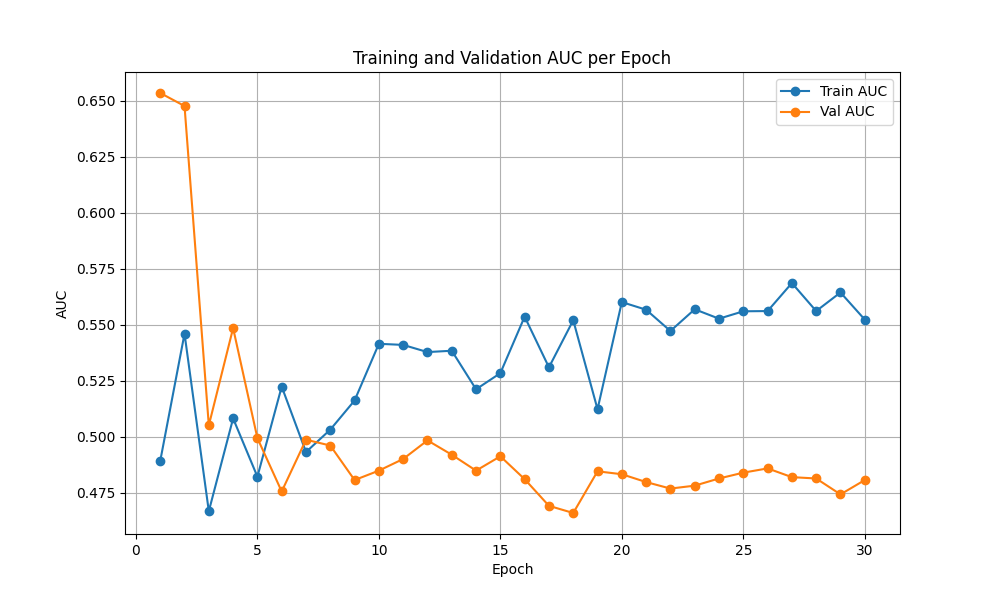
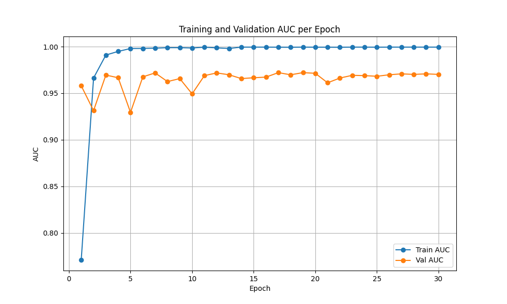
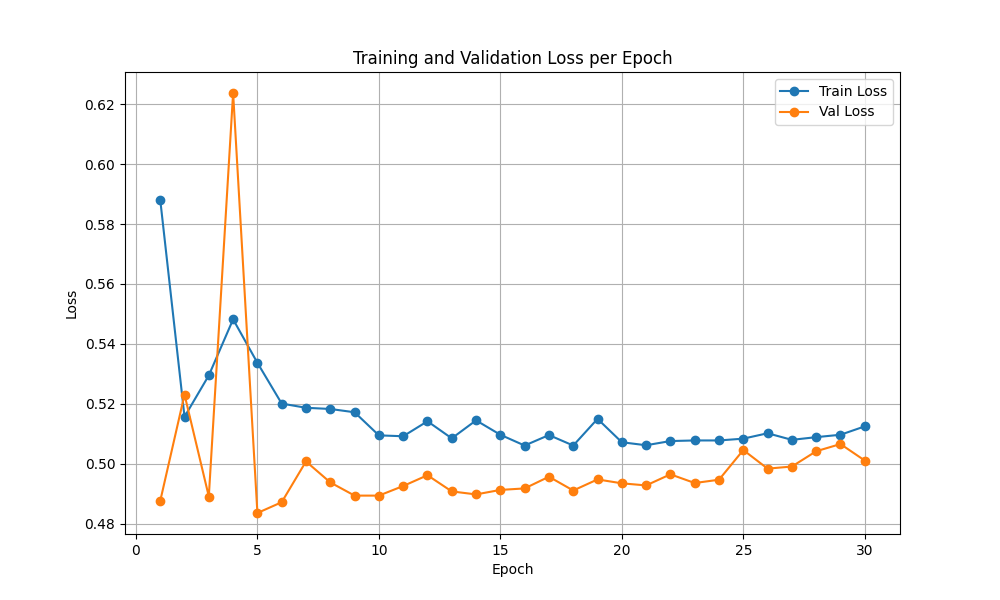
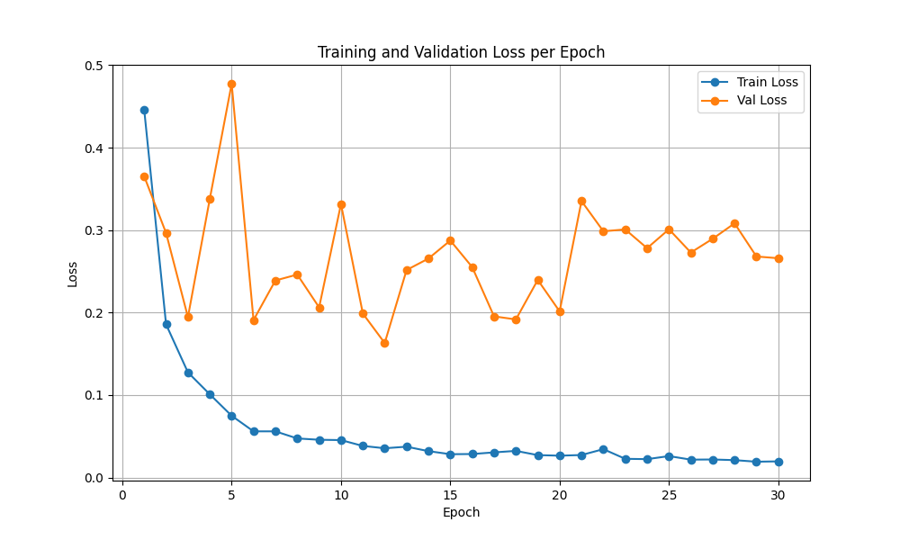
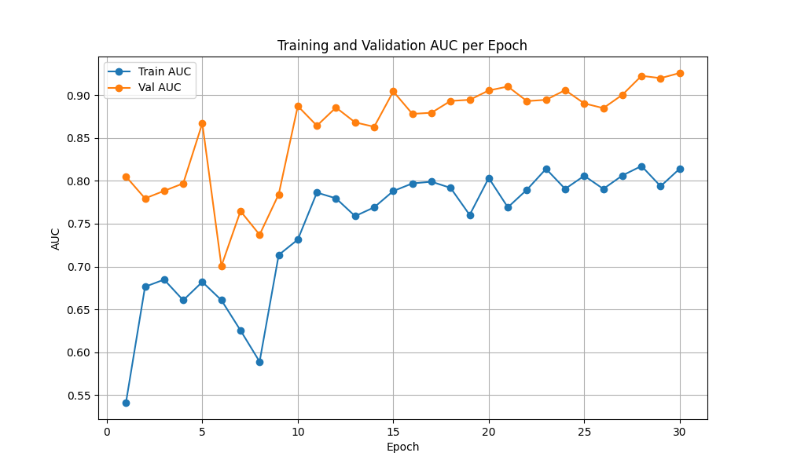
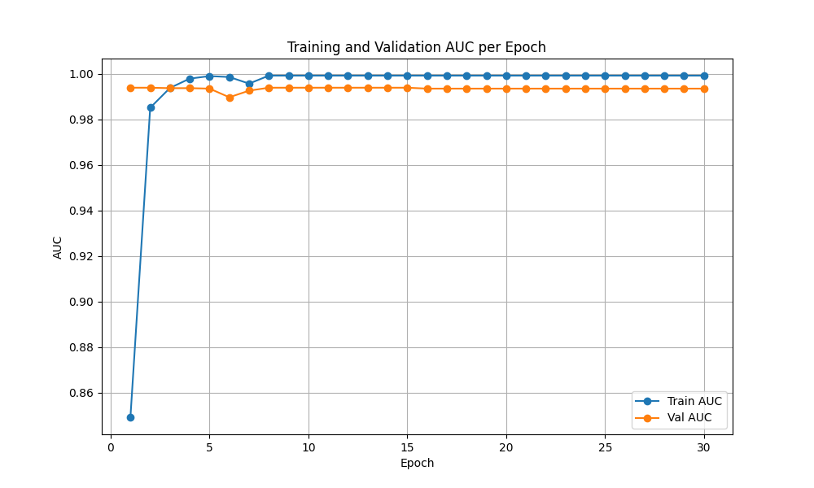

# WSI Classification with MoE-based Token Compression

[](https://www.python.org/downloads/)
[](https://pytorch.org/)
[](https://opensource.org/licenses/MIT)

Production-ready PyTorch research codebase for **Whole Slide Image (WSI) Classification** using a novel **Mixture of Experts (MoE) Token Compression** mechanism.

## 🎯 Overview

This project implements a deep learning pipeline for classifying Whole Slide Images using pre-extracted patch features from foundation models (UNI, CTransPath, etc.). The core innovation is the **MoE Token Compressor** that intelligently reduces thousands of variable-length patch embeddings into a fixed set of semantic tokens for classification.

### Key Innovation

**MoE Token Compressor**: Each patch is routed to expert slots via a gating network, aggregated with weighted pooling, and processed by dedicated experts. This approach:
- ✅ Compresses N variable patches → K fixed semantic tokens
- ✅ Learns semantic clustering of tissue patterns
- ✅ Ensures load balancing across experts
- ✅ Outperforms standard attention-based MIL


---

## 🔧 Model Architecture

**MoE Token Compressor**:

```
Input: [Batch=1, N, 1024] (Variable N per slide)
    ↓
Gate Network: Linear(1024 → K slots)
    ↓
Top-1 Routing: Assign patches to expert slots
    ↓
Weighted Aggregation: Pool patches per slot
    ↓
Expert Processing: Each slot refines features
    ↓
Output: [Batch=1, K, 1024] (Fixed K tokens)
```

**Load Balancing Loss**:
```
expert_importance = Σ gate_probs per slot
CV² = (std / mean)²
Total Loss = CrossEntropyLoss + λ × CV²
```

**Complete WSI Classifier**:

```
Input [1, N, 1024]
  ↓
MoE Compressor [1, K, 1024]
  ↓
Mean Pooling [1, 1024]
  ↓
MLP Classifier [1, num_classes]
  ↓
Output: Logits
```

---

## 🎛️ Hyperparameter Tuning

### Key Parameters

| Parameter | Range | Effect |
|-----------|-------|--------|
| `num_slots` | 32-128 | Compression vs. capacity trade-off |
| `aux_loss_weight` | 0.001-0.1 | Load balancing strength |
| `lr` | 5e-5 to 2e-4 | Learning rate |
| `grad_accum_steps` | 4-16 | Effective batch size |


---


# Evaluation Results
## 1. Summary of New Training Results
Based on the latest evaluation runs in `/workspace/ETC/eval_results`, here are the performance metrics for the four categories:
| Model | Dataset | Accuracy | AUC | Precision | Recall | F1 Score |
|-------|---------|----------|-----|-----------|--------|----------|
| **ResNet-50** | TCGA-BRCA | 0.8021 | 0.6958 | 0.6433 | 0.8021 | 0.7140 |
| **UNI** | TCGA-BRCA | 0.9271 | 0.9672 | 0.9259 | 0.9271 | 0.9263 |
| **ResNet-50** | TCGA-NSCLC | 0.7423 | 0.8315 | 0.7571 | 0.7423 | 0.7398 |
| **UNI** | TCGA-NSCLC | 0.8969 | 0.9881 | 0.9076 | 0.8969 | 0.8959 |
**Key Observations:**
- The **UNI encoder** significantly outperforms ResNet-50 on both datasets, achieving near 99% AUC on NSCLC and 97% on BRCA.
- **ResNet-50 on BRCA** shows signs of mode collapse (predicting only the majority class), resulting in an accuracy that matches the majority class prevalence (~80%) but a poor Recall for the minority class (0.0).
---
## 2. Training Visualization
Selected training plots showing the progression of Accuracy, AUC, and Loss.
### TCGA-BRCA (ResNet-50 vs UNI)
| ResNet-50 AUC | UNI AUC |
|:---:|:---:|
|  |  |
| ResNet-50 Loss | UNI Loss |
|  |  |
### TCGA-NSCLC (ResNet-50 vs UNI)
| ResNet-50 AUC | UNI AUC |
|:---:|:---:|
|  |  |
---
## 3. Analysis: BRCA-ResNet-50 AUC Decline
A detailed inspection of the training process for `brca-r50` reveals a problematic trend where the AUC may degrade or stagnate despite reasonable accuracy.
**Root Cause Analysis:**
The evaluation metrics show a confusion matrix of:
```
[[77, 0],
 [19, 0]]
```
This indicates **Mode Collapse** where the model predicts the negative class (0) for all samples. 
- **High Accuracy (80.2%)** is misleading; it simply reflects the class imbalance (77/96 samples are class 0).
- **Declining/Low AUC**: Since the model is not learning to discriminate and pushes all probabilities towards one class or becomes unconfident/random regarding the minority class, the ranking capability (AUC) suffers.
- **Possible Reasons**:
    1. **Severe Class Imbalance**: The dataset has significantly more negatives than positives. Without oversampling or weighted loss, the model falls into the local minimum of "always predict majority".
    2. **Encoder Capacity**: ResNet-50 might be struggling to extract robust features for this specific task compared to UNI, leading to faster overfitting to the majority class priors.
    3. **Hyperparameters**: The learning rate might be too high, preventing the model from settling into a solution that distinguishes the minority class.
**Recommendation**: Implement **Weighted Cross Entropy Loss** or perform **Oversampling** for the minority class to force the ResNet-50 model to learn features for Class 1.

---

## 📚 Additional Resources

- **Quick Start Guide**: See `QUICKSTART.md` for step-by-step tutorial
- **Project Structure**: See `PROJECT_STRUCTURE.md` for detailed organization
- **Example Configs**: Check `configs/default.yaml` for configuration templates

---

## 📄 License

This project is licensed under the MIT License - see the [LICENSE](LICENSE) file for details.

---

## 📧 Contact

For questions, issues, or collaboration:
- **GitHub Issues**: [Report bugs or request features](https://github.com/OzzyChen97/wsi-moe-classifier/issues)
- **Email**: comfortableapple@gmail.com

---

## 🙏 Acknowledgments

- Built with PyTorch
- Inspired by Mixture of Experts literature
- Designed for computational pathology research

---

## ⭐ Citation

If you use this code in your research, please cite:

```bibtex
@software{wsi_moe_classifier,
  title={WSI Classification with MoE Token Compression},
  author={OzzyChen97},
  year={2024},
  url={https://github.com/OzzyChen97/wsi-moe-classifier}
}
```

---

**Happy Training! 🚀**
