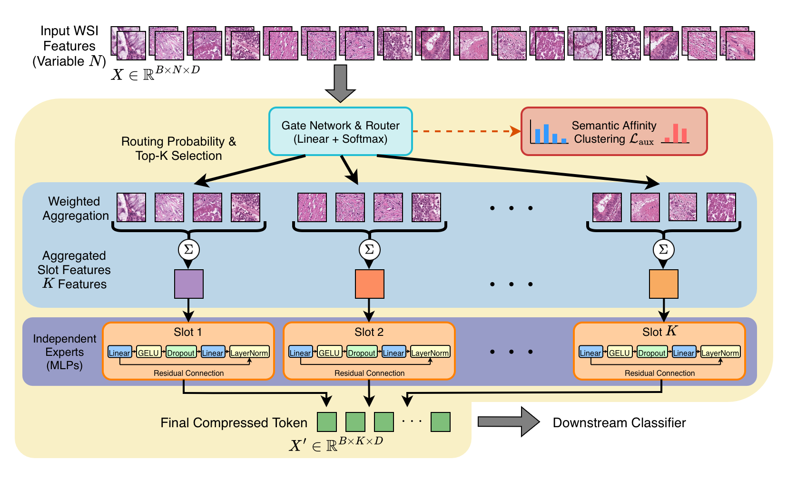
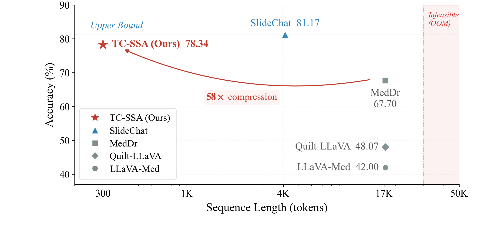
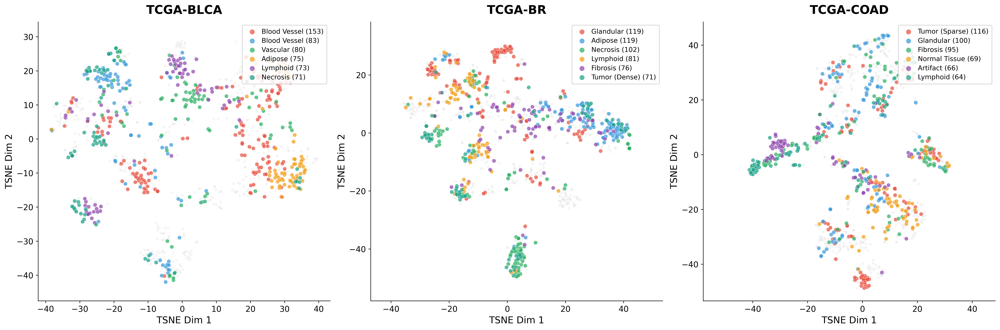
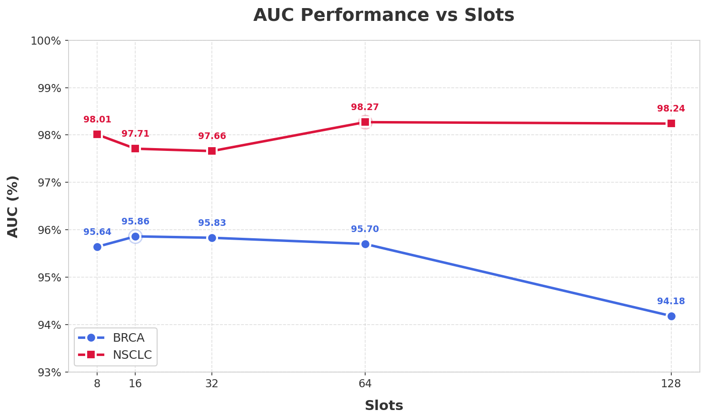

# TC-SSA: Token Compression via Semantic Slot Aggregation for Gigapixel Spatial Reasoning

[](https://www.python.org/downloads/)
[](https://pytorch.org/)
[](https://www.miccai.org/)
[](https://opensource.org/licenses/MIT)

Official PyTorch implementation of **TC-SSA**, a learnable token-budgeting mechanism that compresses gigapixel Whole Slide Images (WSIs) into compact semantic representations for vision-language models.

---

## 🎯 Abstract

Gigapixel Whole-Slide Images (WSIs) pose a fundamental challenge for vision-language assistants due to extreme sequence lengths. We propose **TC-SSA** (Token Compression via Semantic Slot Aggregation), a learnable token-budgeting mechanism that aggregates $N$ patch features into a fixed budget of $K$ semantic slots ($K \ll N$) via **gated Top-2 assignment**. TC-SSA is regularized by a **Semantic Affinity Clustering** objective.

### 🏆 Key Results
- **95.83% AUC** on TCGA-BRCA
- **98.27% AUC** on TCGA-NSCLC  
- **78.34% Overall Accuracy** on SlideChat VQA
- **98.3% Token Reduction** (57.56× fewer visual tokens)
- **120× Patch-to-Slot Aggregation Ratio** (when $N=3840$, $K=32$)

---

## 💡 Motivation

The "gigapixel bottleneck" is a formidable barrier in computational pathology: a single WSI can contain upward of $10^5$ patches, creating sequence lengths that far exceed the limits of standard Transformer architectures.

### The Problem with Existing Approaches

| Approach | Method | Limitation |
|----------|--------|------------|
| **Spatial Sampling** | LLaVA-Med, Quilt-LLaVA | ⚠️ May miss diagnostically critical regions (unsafe pruning) |
| **Sparse Attention** | SlideChat | ⚠️ High inference cost |
| **MIL Aggregation** | TransMIL, ABMIL | ⚠️ Limited multimodal reasoning |

### Our Solution: Safety-First Compression

TC-SSA replaces **patch pruning** with **semantic aggregation** that preserves global slide context. All patch evidence contributes to the final representation — nothing is discarded.

---

## 🏗️ Architecture

TC-SSA is a mixture-of-experts (MoE) style token compressor that maps variable-length patch features to a fixed number of slot tokens.

<p align="center">
  
</p>

### Pipeline Overview

```
Input: [B, N, D] (Variable N patches per slide, D=1024 from CONCH)
    ↓
┌─────────────────────────────────────────────────────────┐
│ 1. Gated Routing                                        │
│    z(x_j) = W_g · x_j  →  Softmax with Gaussian noise   │
└─────────────────────────────────────────────────────────┘
    ↓
┌─────────────────────────────────────────────────────────┐
│ 2. Top-2 Assignment                                     │
│    Each patch → Top 2 highest-probability slots         │
└─────────────────────────────────────────────────────────┘
    ↓
┌─────────────────────────────────────────────────────────┐
│ 3. Weighted Slot Aggregation                            │
│    c_k = Σ(P̃_{j,k} · x_j) / Σ(P̃_{j,k})                │
└─────────────────────────────────────────────────────────┘
    ↓
┌─────────────────────────────────────────────────────────┐
│ 4. Per-Slot Expert Refinement                           │
│    y_k = c_k + LN(W_2 · Dropout(GELU(W_1 · c_k)))      │
└─────────────────────────────────────────────────────────┘
    ↓
Output: [B, K, D] (Fixed K=32 semantic tokens)
```

### Mathematical Formulation

**Gated Routing:**
$$z(x_j) = W_g x_j, \quad W_g \in \mathbb{R}^{K \times D}$$
$$\tilde{z}(x_j) = z(x_j) + \epsilon, \quad \epsilon \sim \mathcal{N}(0, \sigma^2), \; \sigma=0.1$$

**Routing Probabilities:**
$$P(x_j) = \text{Softmax}(\tilde{z}(x_j)) \in \mathbb{R}^{K}$$

**Weighted Aggregation:**
$$c_k = \frac{\sum_{j=1}^{N} \tilde{P}_{j,k}\,x_j}{\sum_{j=1}^{N} \tilde{P}_{j,k} + \delta}, \quad \delta = 10^{-9}$$

### Semantic Affinity Clustering Loss

The auxiliary loss combines three terms to ensure balanced slot utilization:

| Loss Term | Formula | Purpose |
|-----------|---------|---------|
| **Switch Loss** | $\mathcal{L}_{\text{switch}} = K\sum_{i=1}^{K} P_i f_i$ | Load balancing |
| **Entropy Loss** | $\mathcal{L}_{\text{ent}} = 1 - \frac{-\sum_{i=1}^{K} P_i\log(P_i+\eta)}{\log K}$ | Prevent collapse |
| **Z-Loss** | $\mathcal{L}_{z} = \gamma(\mathbb{E}_{j}[\log \sum_{i=1}^{K} \exp(z_i)])^2$ | Stabilize logits |

**Total:** $\mathcal{L}_{aux} = \mathcal{L}_{\text{switch}} + 0.5\,\mathcal{L}_{\text{ent}} + \mathcal{L}_{z}$

### Computational Complexity

| Method | Complexity |
|--------|------------|
| Dense Self-Attention | $O(N^2 \cdot D)$ |
| **TC-SSA** | $O(N \cdot K \cdot D)$ |

---

## 📊 Experimental Results

### SlideChat VQA Benchmark

<p align="center">
  
</p>

| Methods | Microscopy | Diagnosis | Clinical | Overall | SlideBench(BCNB) | WSI-VQA* |
|---------|------------|-----------|----------|---------|------------------|----------|
| *SlideChat (Upper Bound)* | *87.64* | *73.27* | *84.26* | *81.17* | *54.14* | *60.18* |
| Random Baseline | 24.44 | 24.91 | 26.44 | 25.02 | 24.40 | 24.14 |
| GPT-4o | 62.89 | 46.69 | 66.77 | 57.91 | 41.43 | 30.41 |
| LLaVA-Med | 47.34 | 32.78 | 47.96 | 42.00 | 30.10 | 26.31 |
| Quilt-LLaVA | 57.76 | 35.96 | 53.07 | 48.07 | 32.19 | 44.43 |
| MedDr | 73.30 | 57.78 | 74.25 | 67.70 | 33.67 | 54.36 |
| **TC-SSA (Ours)** | **81.94** | **77.14** | **76.53** | **78.34** | **55.94** | **56.62** |

> 💡 **Key Finding:** In the challenging *Diagnosis* task, TC-SSA achieves **77.14%**, exceeding SlideChat (73.27%). Our aggregation-based compression acts as a semantic filter — while uncompressed sparse attention may retain redundancy, our gated slot mechanism clusters homogeneous tissue patterns and suppresses background noise.

### TCGA MIL Classification (AUC)

| Method | TCGA-BRCA | TCGA-NSCLC |
|--------|-----------|------------|
| ABMIL | 94.05±3.49 | 97.04±1.60 |
| TransMIL | 93.33±3.50 | 97.27±1.58 |
| RRTMIL | 94.61±3.18 | 97.88±1.18 |
| 2DMamba | 93.08±4.20 | 97.14±1.48 |
| ResNet-50+ABMILX | 95.17 | 97.06 |
| **TC-SSA (Ours)** | **95.83** | **98.27** |

### Expert Specialization Visualization

<p align="center">
  
</p>

Multi-dataset t-SNE of patch embeddings grouped by expert/slot (TCGA-BLCA, TCGA-BR, TCGA-COAD). Colored clusters correspond to different tissue semantics, demonstrating that expert assignment induces coherent, dataset-consistent grouping.

---

## 🔧 Model Configuration

| Parameter | Value | Description |
|-----------|-------|-------------|
| Visual Backbone | CONCH (frozen) | Patch feature extractor |
| Feature Dimension | 1024 | Input/output dimension |
| Number of Slots (K) | 32 | Default semantic slot budget |
| Routing | Top-2 Gated | Assignment strategy |
| Expert Hidden Dim | 512 | MLP hidden dimension |
| Dropout | 0.25 | Expert MLP dropout |
| Aux Loss Weight (λ) | 0.1 | Semantic Affinity Clustering |

### Ablation: Number of Slots

<p align="center">
  
</p>

- **TCGA-BRCA:** Stable for $K \in \{16, 32, 64\}$; drops at $K=128$ due to over-fragmentation
- **TCGA-NSCLC:** Marginal gains beyond $K=32$
- **Recommendation:** $K=32$ as balanced choice

---

## 🚀 Quick Start

### Installation

```bash
git clone https://github.com/your-repo/TC-SSA.git
cd TC-SSA
pip install -r requirements.txt
```

### Training

**MIL Classification:**
```bash
python tools/train.py \
    --dataset tcga-brca \
    --num_slots 32 \
    --aux_loss_weight 0.1 \
    --epochs 100
```

**SlideChat VQA (Stage 1 - Projector Alignment):**
```bash
torchrun --nproc_per_node=4 vqa/tools/train_slidechat.py \
    --stage 1 \
    --moe_checkpoint /path/to/moe_checkpoint.pth \
    --llm_path vqa/data/Qwen3-4B-Instruct-2507 \
    --data_path vqa/data/SlideChat/SlideInstruct_train_stage1_caption.json \
    --features_dir vqa/data/GTEx-TCGA-Embeddings \
    --output_dir vqa/outputs/slidechat_stage1 \
    --moe_num_slots 32
```

**SlideChat VQA (Stage 2 - LoRA Finetuning):**
```bash
torchrun --nproc_per_node=4 vqa/tools/train_slidechat_stage2.py \
    --moe_checkpoint /path/to/moe_checkpoint.pth \
    --llm_path vqa/data/Qwen3-4B-Instruct-2507 \
    --projector_checkpoint vqa/outputs/slidechat_stage1/final/projector.pt \
    --data_path vqa/data/SlideChat/SlideInstruct_train_stage2_vqa_filtered.json \
    --features_dir vqa/data/GTEx-TCGA-Embeddings \
    --output_dir vqa/outputs/slidechat_stage2_lora \
    --batch_size 4 \
    --gradient_accumulation_steps 4 \
    --num_epochs 3 \
    --lr 2e-4 \
    --lora_r 16 \
    --moe_num_slots 32
```

### Evaluation

```bash
python vqa/tools/test_benchmark_csv.py \
    --model_path vqa/outputs/slidechat_stage2_lora/epoch2_step500 \
    --moe_checkpoint outputs/moe_tcga_experiment/best_model.pth \
    --llm_path vqa/data/Qwen3-4B-Instruct-2507 \
    --benchmark_path vqa/data/SlideChat/SlideBench-VQA-TCGA.csv \
    --features_dir vqa/data/GTEx-TCGA-Embeddings \
    --output_path vqa/results/benchmark_results.json \
    --batch_size 16
```

---

## 📁 Project Structure

```
TC-SSA/
├── src/
│   └── models/
│       └── moe_compressor.py    # TC-SSA core implementation
├── tools/
│   ├── train.py                 # MIL classification training
│   └── train_panda.py           # PANDA dataset training
├── vqa/
│   ├── tools/
│   │   ├── train_slidechat.py   # Stage 1 training
│   │   ├── train_slidechat_stage2.py  # Stage 2 LoRA finetuning
│   │   └── test_benchmark_csv.py      # Evaluation
│   └── data/                    # Data and model checkpoints
├── docs/
│   ├── miccai.tex              # Paper source
│   ├── flowchart.png           # Architecture diagram
│   ├── optimize.png            # Efficiency plot
│   └── auc_chart.png           # Ablation plot
└── configs/
    └── default.yaml            # Default configuration
```

---

## 🔬 Discussion

### Key Contributions

1. **Safety-First Compression:** We replace patch pruning with semantic aggregation that preserves global slide context — no evidence is discarded.

2. **TC-SSA Architecture:** A novel gated assignment bottleneck that distills gigapixel-scale inputs into concise semantic slots.

### Limitations and Future Work

- **Fixed slot budget:** A single $K$ may not be optimal across slides with varying complexity; dynamic slot budgeting is a promising direction.
- **Encoder dependence:** Slot quality depends on the patch encoder; stronger or domain-adapted backbones may further improve quality.
- **Spatial structure:** Aggregation may lose fine-grained local geometry; integrating lightweight spatial priors could improve localization tasks.

---

## 📄 License

This project is licensed under the MIT License - see the [LICENSE](LICENSE) file for details.

---

## ⭐ Citation

If you use this code in your research, please cite:

```bibtex
@inproceedings{tc-ssa2026,
  title={TC-SSA: Token Compression via Semantic Slot Aggregation for Gigapixel Spatial Reasoning},
  author={Anonymized Authors},
  booktitle={Medical Image Computing and Computer Assisted Intervention (MICCAI)},
  year={2026}
}
```

---

## 🙏 Acknowledgments

- CONCH foundation model for pathology feature extraction
- SlideChat benchmark for VQA evaluation
- TCGA for public pathology datasets
- Built with PyTorch and Hugging Face Transformers

---

**Happy Training! 🚀**
