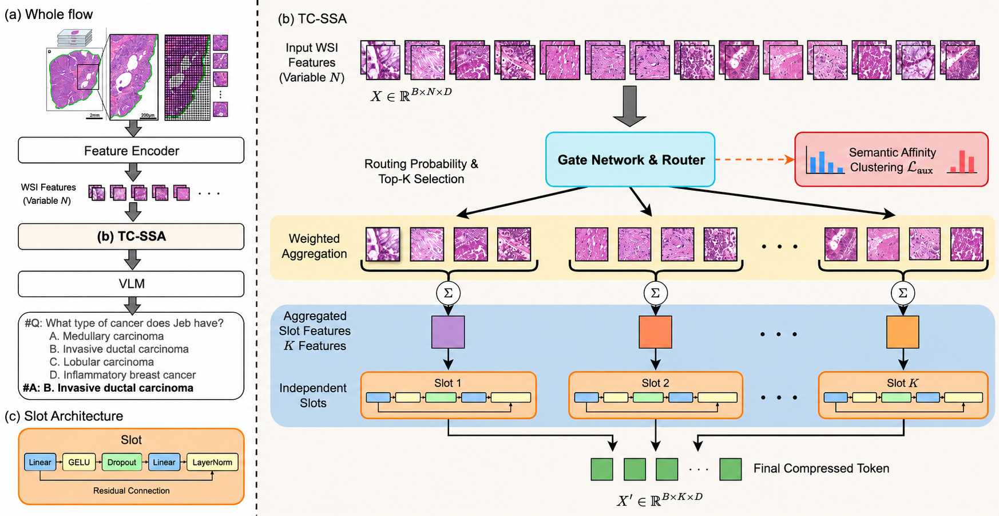
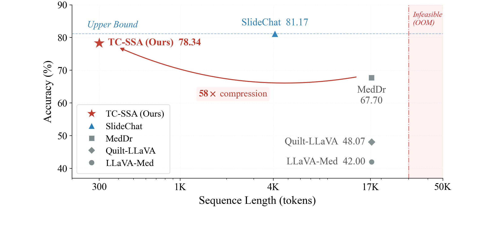
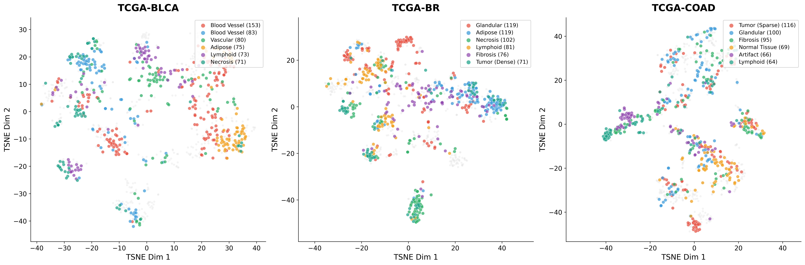
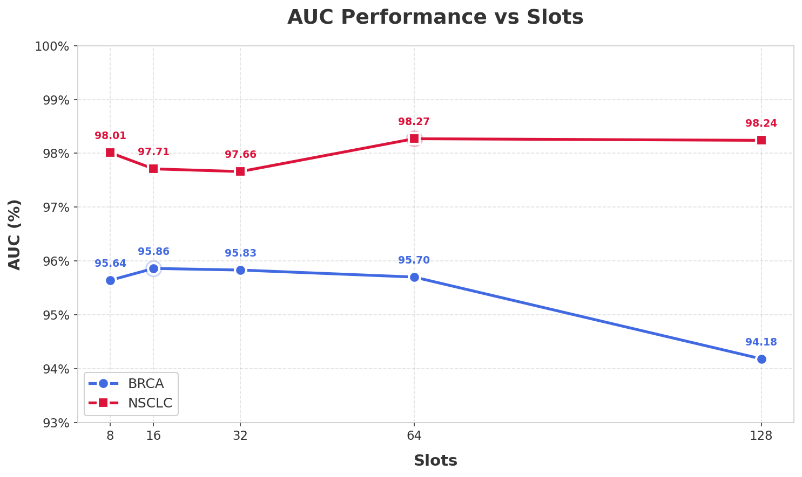

# TC-SSA: Token Compression via Semantic Slot Aggregation for Gigapixel Pathology Reasoning

[](https://www.python.org/downloads/)
[](https://pytorch.org/)
[](https://opensource.org/licenses/MIT)
[](https://ozzychen97.github.io/TC-SSA/)
[](https://arxiv.org/pdf/2603.01143)

Official PyTorch implementation of **TC-SSA**, a learnable token-budgeting mechanism that compresses gigapixel Whole Slide Images (WSIs) into compact semantic representations for vision-language models.

**Links:** [Project homepage](https://ozzychen97.github.io/TC-SSA/) | [arXiv paper](https://arxiv.org/pdf/2603.01143) | [Code](https://github.com/OzzyChen97/TC-SSA)

**Authors:** [Zhuo Chen](https://orcid.org/0009-0000-6089-1368)<sup>1,2</sup>, [Xiaoyu Yang](https://orcid.org/0000-0003-0273-9573)<sup>1</sup>, and [Lijian Xu](https://orcid.org/0000-0002-6632-4011)<sup>1,*</sup>

<sup>1</sup> Shenzhen University of Advanced Technology, Shenzhen, Guangdong, China  
<sup>2</sup> University of Nottingham Ningbo China, FoSE, Ningbo, Zhejiang, China  
<sup>*</sup> Corresponding author: [xulijian@suat-sz.edu.cn](mailto:xulijian@suat-sz.edu.cn)

---

## 🎯 Abstract

Gigapixel Whole-Slide Images (WSIs) pose a fundamental challenge for vision-language assistants due to extreme sequence lengths. We propose **TC-SSA** (Token Compression via Semantic Slot Aggregation), a learnable token-budgeting mechanism that aggregates $N$ patch features into a fixed budget of $K$ semantic slots ($K \ll N$) via **sparse Top-2 routing**. TC-SSA is regularized by a robust semantic slot objective that stabilizes slot utilization without forcing equal assignment.

### 🏆 Key Results
- **78.34% Overall Accuracy** on SlideBench (TCGA)
- **77.14% Diagnosis Accuracy** on SlideBench (TCGA)
- **55.94% Zero-shot Accuracy** on SlideBench (BCNB)
- **56.62% Zero-shot Accuracy** on WSI-VQA*
- **95.83% AUC** on TCGA-BRCA
- **98.27% AUC** on TCGA-NSCLC
- **79.80% ISUP Grading Accuracy** on PANDA
- **1.7% Visual Tokens Retained** (98.3% reduction; 58× compression)
- **1.72T FLOPs** under token compression, compared with 133.3T for uncompressed SlideChat inference

---

## 💡 Motivation

The "gigapixel bottleneck" is a formidable barrier in computational pathology: a single WSI can contain upward of $10^5$ patches, creating sequence lengths that far exceed the limits of standard Transformer architectures.

### The Problem with Existing Approaches

| Approach | Method | Limitation |
|----------|--------|------------|
| **Spatial Sampling** | LLaVA-Med, Quilt-LLaVA | ⚠️ May miss diagnostically critical regions (unsafe pruning) |
| **Sparse Attention** | SlideChat | ⚠️ High inference cost |
| **MIL Aggregation** | TransMIL, ABMIL | ⚠️ Limited multimodal reasoning |

### Our Solution: Safety-First Compression

TC-SSA replaces **patch pruning** with **semantic aggregation** that preserves global slide context. All patch evidence contributes to the final representation — nothing is discarded.

---

## 🏗️ Architecture

TC-SSA is a mixture-of-experts (MoE) style token compressor that maps variable-length patch features to a fixed number of slot tokens.

<p align="center">
  
</p>

### Pipeline Overview

- Input: $X \in \mathbb{R}^{B \times N \times D}$ (variable $N$ patches per slide, $D=1024$ from CONCH)
- Step 1 (Gated Routing): $g_{b,j} = x_{b,j} W_g + b_g$
- Step 2 (Top-2 Assignment):

```math
P_{b,j,:} = \mathrm{softmax}(g_{b,j}), \qquad \tilde{P}_{b,j,k} = m_{b,j,k}P_{b,j,k}
```

- Step 3 (Weighted Slot Aggregation):

```math
X'_{b,k,:} = c_{b,k} = \frac{\sum_{j=1}^{N} \tilde{P}_{b,j,k}x_{b,j}}{\sum_{j=1}^{N} \tilde{P}_{b,j,k} + \delta}
```

- Output: $X' \in \mathbb{R}^{B \times K \times D}$ (fixed $K=32$ semantic tokens)

### Mathematical Formulation

**Gated Routing:** $g_{b,j} = x_{b,j} W_g + b_g$, $W_g \in \mathbb{R}^{D \times K}$, $b_g \in \mathbb{R}^{K}$

**Routing Probabilities:** $P_{b,j,:} = \mathrm{softmax}(g_{b,j}) \in \mathbb{R}^{K}$

**Top-2 Routing:** $m_{b,j,k} \in \{0,1\}$ indicates whether slot $k$ is among the Top-2 choices for patch $j$, and $\tilde{P}_{b,j,k} = m_{b,j,k}P_{b,j,k}$

**Weighted Aggregation:**

```math
X'_{b,k,:} = c_{b,k} = \frac{\sum_{j=1}^{N} \tilde{P}_{b,j,k}x_{b,j}}{\sum_{j=1}^{N} \tilde{P}_{b,j,k} + \delta}, \qquad \delta = 10^{-9}
```

### Robust Semantic Slot Regularization

The auxiliary objective combines three soft regularizers to discourage routing collapse while preserving semantic specialization:

**Switch Loss** (load balancing):

```math
\mathcal{L}_{\mathrm{switch}} = K\sum_{k=1}^{K} P_k f_k
```

**Entropy Loss** (prevent collapse):

```math
\mathcal{L}_{\mathrm{ent}} = 1 - \frac{-\sum_{k=1}^{K} P_k\log(P_k+\epsilon)}{\log K}, \qquad \epsilon = 10^{-8}
```

**Z-Loss** (stabilize logits):

```math
\mathcal{L}_{z} = \alpha \left(\frac{1}{BN}\sum_{b=1}^{B}\sum_{j=1}^{N}\log\sum_{k=1}^{K}\exp(g_{b,j,k})\right)^2, \qquad \alpha = 10^{-4}
```

**Total:**

```math
\mathcal{L}_{\mathrm{total}} = \mathcal{L}_{\mathrm{task}} + \lambda(\mathcal{L}_{\mathrm{switch}} + 0.5\,\mathcal{L}_{\mathrm{ent}} + \mathcal{L}_{z})
```

### Computational Complexity

| Method | Complexity |
|--------|------------|
| Dense Self-Attention | $O(N^2 \cdot D)$ |
| **TC-SSA** | $O(N \cdot K \cdot D)$ |

---

## 📊 Experimental Results

### SlideBench VQA Benchmark

<p align="center">
  
</p>

| Methods | FLOPs | Microscopy | Diagnosis | Overall | SlideBench (BCNB) | WSI-VQA* |
|---------|-------|------------|-----------|---------|-------------------|----------|
| *SlideChat (Uncompressed Upper Bound)* | *133.3T* | *87.64* | *73.27* | *81.17* | *54.14* | *60.18* |
| Random Baseline | - | 24.44 | 24.91 | 25.02 | 24.40 | 24.14 |
| GPT-4o | - | 62.89 | 46.69 | 57.91 | 41.43 | 30.41 |
| LLaVA-Med | 1.70T | 47.34 | 32.78 | 42.00 | 30.10 | 26.31 |
| Quilt-LLaVA | 1.70T | 57.76 | 35.96 | 48.07 | 32.19 | 44.43 |
| MedDr | 1.70T | 73.30 | 57.78 | 67.70 | 33.67 | 54.36 |
| **TC-SSA (Ours)** | **1.72T** | **81.94** | **77.14** | **78.34** | **55.94** | **56.62** |

> 💡 **Key Finding:** In the challenging *Diagnosis* task, TC-SSA achieves **77.14%**, exceeding the uncompressed SlideChat upper bound (73.27%) while using only 32 visual tokens. Compared with sampling baselines such as LLaVA-Med and Quilt-LLaVA, TC-SSA preserves global evidence through semantic aggregation instead of discarding patches.

### MIL Classification and PANDA Grading

BRCA and NSCLC are reported by AUC, while PANDA is reported by ISUP grading accuracy. Baseline values are means from the camera-ready version.

| Encoder | Method | TCGA-BRCA | TCGA-NSCLC | PANDA |
|---------|--------|-----------|------------|-------|
| ResNet-50 | ABMIL | 83.80 | 92.32 | 58.89 |
| ResNet-50 | TransMIL | 88.52 | 92.49 | 56.42 |
| ResNet-50 | RRTMIL | 89.35 | 94.43 | 61.97 |
| ResNet-50 | 2DMamba | 87.22 | 95.21 | 61.56 |
| GigaPath | ABMIL | 94.39 | 96.54 | 71.85 |
| GigaPath | TransMIL | 93.97 | 97.61 | 65.45 |
| GigaPath | GigaPath | 93.72 | 97.53 | 65.86 |
| GigaPath | RRTMIL | 94.82 | 97.63 | 72.46 |
| GigaPath | 2DMamba | 93.84 | 96.87 | 75.72 |
| UNI | ABMIL | 94.05 | 97.04 | 74.69 |
| UNI | TransMIL | 93.33 | 97.27 | 68.06 |
| UNI | RRTMIL | 94.61 | 97.88 | 74.93 |
| UNI | 2DMamba | 93.08 | 97.14 | 76.37 |
| UNI | **TC-SSA (Ours)** | **95.83** | **98.27** | **79.80** |

### Expert Specialization Visualization

<p align="center">
  
</p>

Multi-dataset t-SNE of patch embeddings grouped by expert/slot (TCGA-BLCA, TCGA-BR, TCGA-COAD). Colored clusters correspond to different tissue semantics, demonstrating that expert assignment induces coherent, dataset-consistent grouping.

---

## 🔧 Model Configuration

| Parameter | Value | Description |
|-----------|-------|-------------|
| Visual Backbone | CONCH (VQA), UNI (MIL/PANDA) | Patch feature extractors used in the camera-ready experiments |
| Feature Dimension | 1024 | Input/output dimension |
| Number of Slots (K) | 32 | Default semantic slot budget |
| Routing | Top-2 Gated | Assignment strategy |
| Expert Hidden Dim | 512 | MLP hidden dimension |
| Dropout | 0.25 | Expert MLP dropout |
| Aux Loss Weight (λ) | 0.1 | Robust semantic slot regularization |

### Ablation: Number of Slots

<p align="center">
  
</p>

- **TCGA-BRCA:** Stable for K ∈ {16, 32, 64}; drops at K=128 due to over-fragmentation
- **TCGA-NSCLC:** Marginal gains beyond $K=32$
- **Recommendation:** $K=32$ as balanced choice

---

## 🚀 Quick Start

### Installation

```bash
git clone https://github.com/OzzyChen97/TC-SSA.git
cd TC-SSA
pip install -r requirements.txt
```

### Training

**MIL Classification:**
```bash
python tools/train.py \
    --dataset tcga-brca \
    --num_slots 32 \
    --aux_loss_weight 0.1 \
    --epochs 100
```

**SlideChat VQA (Stage 1 - Projector Alignment):**
```bash
torchrun --nproc_per_node=4 vqa/tools/train_slidechat.py \
    --stage 1 \
    --moe_checkpoint /path/to/moe_checkpoint.pth \
    --llm_path vqa/data/Qwen3-4B-Instruct-2507 \
    --data_path vqa/data/SlideChat/SlideInstruct_train_stage1_caption.json \
    --features_dir vqa/data/GTEx-TCGA-Embeddings \
    --output_dir vqa/outputs/slidechat_stage1 \
    --moe_num_slots 32
```

**SlideChat VQA (Stage 2 - LoRA Finetuning):**
```bash
torchrun --nproc_per_node=4 vqa/tools/train_slidechat_stage2.py \
    --moe_checkpoint /path/to/moe_checkpoint.pth \
    --llm_path vqa/data/Qwen3-4B-Instruct-2507 \
    --projector_checkpoint vqa/outputs/slidechat_stage1/final/projector.pt \
    --data_path vqa/data/SlideChat/SlideInstruct_train_stage2_vqa_filtered.json \
    --features_dir vqa/data/GTEx-TCGA-Embeddings \
    --output_dir vqa/outputs/slidechat_stage2_lora \
    --batch_size 4 \
    --gradient_accumulation_steps 4 \
    --num_epochs 3 \
    --lr 2e-4 \
    --lora_r 16 \
    --moe_num_slots 32
```

### Evaluation

```bash
python vqa/tools/test_benchmark_csv.py \
    --model_path vqa/outputs/slidechat_stage2_lora/epoch2_step500 \
    --moe_checkpoint outputs/moe_tcga_experiment/best_model.pth \
    --llm_path vqa/data/Qwen3-4B-Instruct-2507 \
    --benchmark_path vqa/data/SlideChat/SlideBench-VQA-TCGA.csv \
    --features_dir vqa/data/GTEx-TCGA-Embeddings \
    --output_path vqa/results/benchmark_results.json \
    --batch_size 16
```

---

## 📁 Project Structure

```
TC-SSA/
├── src/
│   └── models/
│       └── moe_compressor.py    # TC-SSA core implementation
├── tools/
│   ├── train.py                 # MIL classification training
│   └── train_panda.py           # PANDA dataset training
├── vqa/
│   ├── tools/
│   │   ├── train_slidechat.py   # Stage 1 training
│   │   ├── train_slidechat_stage2.py  # Stage 2 LoRA finetuning
│   │   └── test_benchmark_csv.py      # Evaluation
│   └── data/                    # Data and model checkpoints
├── docs/
│   ├── index.html             # GitHub Pages homepage
│   ├── styles.css             # Homepage styles
│   ├── flowchart.png           # Architecture diagram
│   ├── optimize.png            # Efficiency plot
│   └── auc_chart.png           # Ablation plot
└── configs/
    └── default.yaml            # Default configuration
```

---

## 🔬 Discussion

### Key Contributions

1. **Safety-First Compression:** We replace patch pruning with semantic aggregation that preserves global slide context — no evidence is discarded.

2. **TC-SSA Architecture:** A novel gated assignment bottleneck that distills gigapixel-scale inputs into concise semantic slots.

### Limitations and Future Work

- **Fixed slot budget:** A single $K$ may not be optimal across slides with varying complexity; dynamic slot budgeting is a promising direction.
- **Encoder dependence:** Slot quality depends on the patch encoder; stronger or domain-adapted backbones may further improve quality.
- **Spatial structure:** Aggregation may lose fine-grained local geometry; integrating lightweight spatial priors could improve localization tasks.

---

## 📄 License

This project is licensed under the MIT License - see the [LICENSE](LICENSE) file for details.

## 📝 Citation

```bibtex
@article{chen2026tcssa,
  title={TC-SSA: Token Compression via Semantic Slot Aggregation for Gigapixel Pathology Reasoning},
  author={Chen, Zhuo and Yang, Xiaoyu and Xu, Lijian},
  journal={arXiv preprint arXiv:2603.01143},
  year={2026}
}
```

---

## 🙏 Acknowledgments

- CONCH foundation model for pathology feature extraction
- SlideChat benchmark for VQA evaluation
- TCGA for public pathology datasets
- Built with PyTorch and Hugging Face Transformers
- Zhuo Chen and Xiaoyu Yang contributed equally to this work
- Zhuo Chen conducted this work during an internship at Shenzhen University of Advanced Technology

---

**Happy Training! 🚀**
