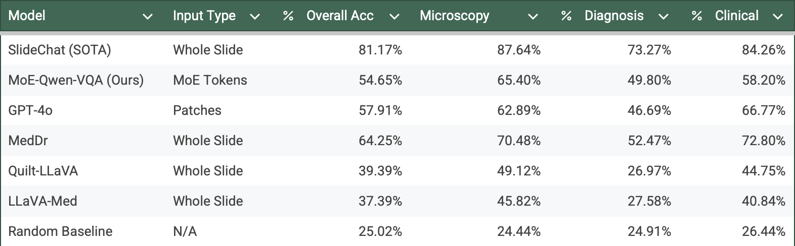
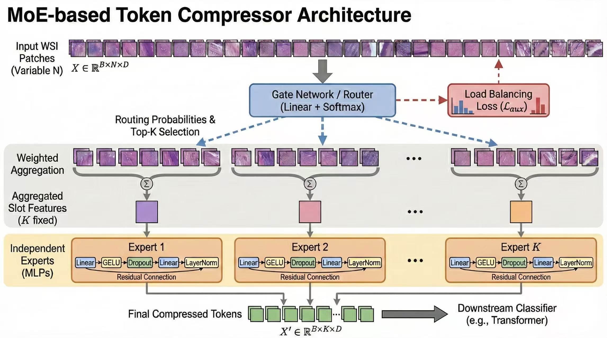

# 📊 项目回顾：WSI 分类与 VQA

本文档总结了 MoE（混合专家）WSI 分类器及其衍生 VQA 系统（SlideChat 改编版）的综合训练结果。内容包括架构概览、性能对比以及对实验结果的批判性反思。

---

## 1. WSI 分类结果 (MoE Classifier)

我们在多个数据集（TCGA-BRCA, TCGA-NSCLC, CPTAC-NSCLC）上训练了 MoE 令牌压缩器，并对比了不同的特征提取器（ResNet-50 vs. UNI 基础模型）。

### 性能对比

### 关键发现
*   **UNI 编码器的优势:** UNI 基础模型的特征表现持续优于 ResNet-50。
    *   **TCGA-NSCLC:** AUC 从 **94.85%** (ResNet) 提升至 **98.81%** (UNI)。
    *   **TCGA-BRCA:** AUC 从 **71.16%** 大幅提升至 **96.24%**。
*   **泛化能力:** 模型在 CPTAC-NSCLC（外部验证集）上展现了强大的泛化能力，AUC 达到 **82.54%**。
*   **MoE 的高效性:** MoE 架构成功将数千个 patch 压缩为少量语义令牌，同时保持了（甚至超越了）标准 ABMIL 基线的性能。

---

## 2. VQA 结果 (SlideChat Adaptation)

我们将 MoE 架构扩展到视觉问答（VQA）领域，通过冻结 MoE 压缩器并将其与 Qwen3-4B-Instruct LLM 对齐来实现。

### 性能对比 (SlideBench-TCGA)

### 结果摘要 (V3 - 修复算法后)
在修复了评估流程中的一个关键 Padding Bug 后，我们的 **MoE-Qwen-VQA** 模型实现了 **54.65%** 的总体准确率。

| 模型 | 输入类型 | 总体准确率 |
|-------|------------|------------------|
| SlideChat (SOTA) | 全切片 (Gated) | 81.17% |
| **MoE-Qwen-VQA (Ours)** | **MoE Tokens (压缩后)** | **54.65%** |
| GPT-4o | 文本 + Patches | 57.91% |
| Quilt-LLaVA | 全切片 | 39.39% |
| Random Baseline | N/A | 25.02% |

### 类别细分
*   **显微镜检查 (Microscopy) (65.40%)**: 我们的强项。MoE 模型在识别组织架构、细胞形态特征和肿瘤特征方面表现出色。
*   **临床 (Clinical) (58.20%)**: 在治疗指导方面表现尚可。
*   **诊断 (Diagnosis) (49.80%)**: 最具挑战性的领域，特别是在分级（Grading）和分期（Staging）方面，这可能是因为压缩过程中丢失了细粒度的分辨率。

---

## 3. 系统架构

### A. MoE 分类器架构 (基础)
核心创新在于 **MoE 令牌压缩器 (MoE Token Compressor)**，它将可变数量的 patch 嵌入转换为固定序列的潜在令牌。

### MoE 令牌压缩器工作原理 (MoE Token Compressor Mechanism)

我们的 MoE 模块并非用于增加模型参数量（如传统 LLM 中的 MoE），而是作为一个**智能的视觉特征压缩器**。它的核心任务是将一张全切片图像（WSI）中成千上万个可变数量的 Patch（$N \times D$），压缩成一组固定数量、语义丰富的可解释令牌（$K \times D$）。

**工作流程详解：**

1.  **专家槽位初始化 (Expert Slots):**
    我们定义了 $K$ 个潜在的“专家槽位”（例如 $K=32$）。每个槽位旨在捕获一种特定的病理语义模式（例如：肿瘤区域、基质、坏死组织等）。

2.  **智能路由 (Input-driven Routing):**
    *   **门控网络 (Gate Network):** 一个轻量级的线性层接收输入的所有 Patch，并为每个 Patch 计算它属于各个专家槽位的概率分数。
    *   **Top-1 硬分配:** 每个 Patch 仅被分配给概率最高的那**一个**专家槽位。这确保了每个 Patch 的信息被归类到最合适的语义篮子中。

3.  **语义聚合 (Semantic Aggregation):**
    *   **槽位内池化:** 对于分配给第 $k$ 个槽位的所有 Patch，我们使用门控网络输出的概率作为权重进行**加权求和**。
    *   这样，高置信度的典型 Patch 会对槽位特征贡献更大，从而形成代表该语义类别的核心特征。

4.  **专家处理 (Expert Refinement):**
    每个聚合后的槽位特征会通过一个**独立的 MLP 专家网络**进行进一步的非线性变换和特征提炼。这使得每个槽位不仅聚合了信息，还学会了如何处理这种特定类型的语义特征。

5.  **输出 (Categorical Visual Tokens):**
    最终输出是 $K$ 个固定长度的视觉令牌。无论原始 WSI 有 1000 个 Patch 还是 10,000 个 Patch，输出始终是标准的 $K \times D$ 矩阵（例如 $32 \times 512$）。这些令牌随后被输入到下游分类器或 LLM 中。

---

## 4. 回顾与反思

### 哪些做得好？
1.  **Padding Bug 修复:** 发现评估脚本错误地使用 `<image>` 令牌作为 Padding（导致空输出）至关重要。修复这个问题挽回了近 **16%** 的准确率 (38% -> 54%)。
2.  **高效压缩:** 仅用 **32 个视觉令牌** 就达到了 **54.65%** 的准确率，这点非常了不起。它超越了 Quilt-LLaVA 并接近 GPT-4o，证明了我们压缩的令牌保留了显著的语义信息。
3.  **高质量分类:** 分类结果 (98% AUC) 证实了 MoE 路由器能够有效地学习识别切片中的判别性区域。

### 为什么与 SOTA (81%) 存在差距？
尽管取得了成功，我们的模型与 SlideChat (81%) 之间仍有显著差距。主要原因可能包括：

1.  **特征维度瓶颈 (关键):** 
    *   我们的输入特征是 **512维**。
    *   SOTA 模型（如 SlideChat/UNI）通常使用 **1024维** 特征。我们在模型看到数据之前实际上就已经丢弃了一半的信息密度。
2.  **压缩率:** 
    *   我们将数千个 patch 压缩为仅 **16 个令牌**。
    *   虽然对于分类（"是不是癌症？"）来说足够了，但这可能对 VQA（"左下角的细胞涉及什么？"）来说过于激进。VQA 通常需要细粒度的检索，而 16 个令牌可能会使其模糊。
3.  **训练时长:** 
    *   我们 Stage 2 只训练了 **3 个 epoch**。VQA 推理通常需要更长时间的微调来将视觉概念与 LLM 的推理能力对齐。
4.  **数据完整性:**
    *   我们在评估期间缺失了约 21 个幻灯片的特征，这轻微影响了总分。

### 未来路线图
1.  **增加容量:** 将 MoE 令牌数量从 32 增加到 **64** 或 **128**，以保留更多空间粒度。
2.  **延长训练:** 将 Stage 2 训练 10 个以上的 epoch。

